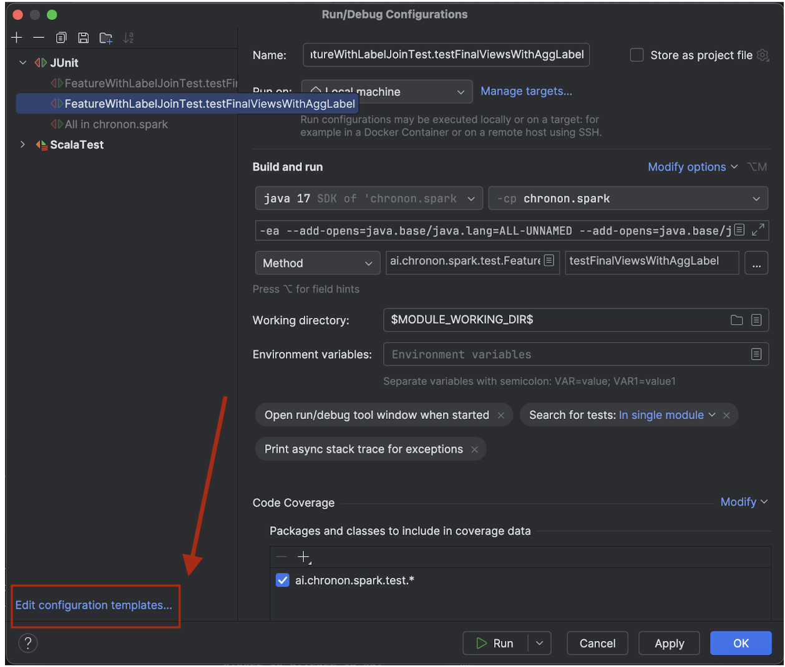
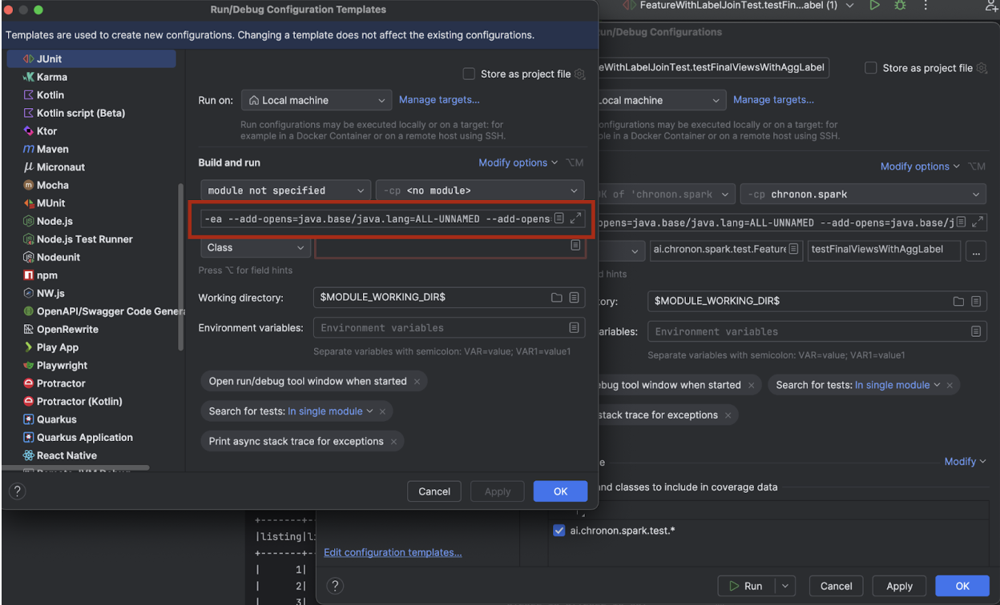
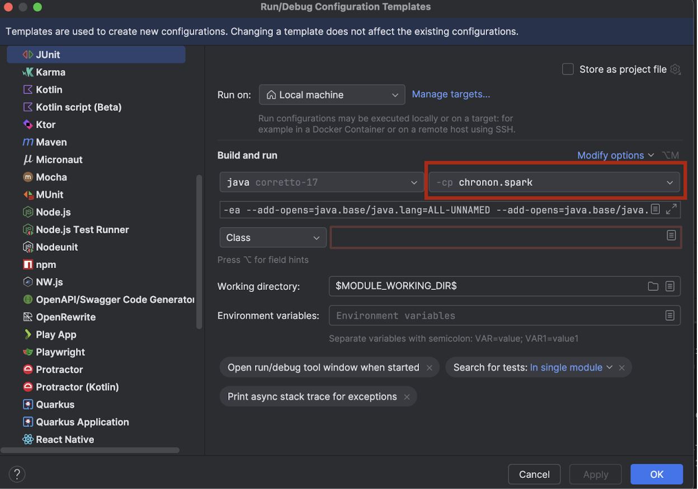

# Intro

## Commands

***All commands assume you are in the root directory of this project***.
For me, that looks like `~/repos/chronon`.

## Prerequisites

Add the following to your shell run command files e.g. `~/.bashrc`.

```
export CHRONON_OS=<path/to/chronon/repo>
export CHRONON_API=$CHRONON_OS/api/py
alias materialize="PYTHONPATH=$CHRONON_API:$PYTHONPATH $CHRONON_API/ai/chronon/repo/compile.py"
```

### Install specific version of thrift

Thrift is a dependency for compile. The latest version 0.14 is very new - feb 2021, and incompatible with hive metastore. So we force 0.13.

```shell
brew tap cartman-kai/thrift
brew install thrift@0.13
```

### Install Python dependency packages for API
```shell
python3 -m pip install -U tox build
```

### Install appropriate java, scala, and python versions
Recommend you do this through a runtime version manager. [asdf](https://asdf-vm.com/) recommended since it works for most all languages.

- Use scala`2.12` and java `corretto-17` for the Zipline Chronon distribution.

- Use scala `2.12.18` and java `corretto-8` for the OSS Chronon distribution.


### Clone the Chronon Repo

```bash
git clone git@github.com:zipline-ai/chronon.git
```

### Configuring IntelliJ

- Open the project from the root `chronon` directory. 
- Under File > Project Structure > Platform Settings, add java `corretto-17` and scala `scala-2.12.18` SDKs.
- Under Intellij IDEA > Settings > Editor > Code Style > Scala enable `scalafmt`.
- Follow the steps below to configure unit tests in intellij:
  
  Run > Edit Configurations
  

  Set the following [java arguments](https://stackoverflow.com/questions/72724816/running-unit-tests-with-spark-3-3-0-on-java-17-fails-with-illegalaccesserror-cl) by copy pasting into the run configuration arguments list:
  ```bash
  --add-opens=java.base/java.lang=ALL-UNNAMED \
  --add-opens=java.base/java.lang.invoke=ALL-UNNAMED \
  --add-opens=java.base/java.lang.reflect=ALL-UNNAMED \ 
  --add-opens=java.base/java.io=ALL-UNNAMED \
  --add-opens=java.base/java.net=ALL-UNNAMED \
  --add-opens=java.base/java.nio=ALL-UNNAMED \
  --add-opens=java.base/java.util=ALL-UNNAMED \
  --add-opens=java.base/java.util.concurrent=ALL-UNNAMED \
  --add-opens=java.base/java.util.concurrent.atomic=ALL-UNNAMED \
  --add-opens=java.base/sun.nio.ch=ALL-UNNAMED \
  --add-opens=java.base/sun.nio.cs=ALL-UNNAMED \
  --add-opens=java.base/sun.security.action=ALL-UNNAMED \
  --add-opens=java.base/sun.util.calendar=ALL-UNNAMED
  ```
  

  Then, set the classpath to `chronon/<module_name>`
  
- Do the same for `ScalaTests` as well.
- Run an [example test](https://github.com/zipline-ai/chronon/blob/main/spark/src/test/scala/ai/chronon/spark/test/bootstrap/LogBootstrapTest.scala) in Chronon to verify that you’ve set things up correctly.

  From CLI: `sbt "testOnly ai.chronon.spark.test.TableUtilsFormatTest"`


**Troubleshooting**

Try the following if you are seeing flaky issues in IntelliJ 
```
sbt +clean 
sbt +assembly
```

### Generate python thrift definitions

```shell
sbt py_thrift
```

### Materializing confs
```
materialize  --input_path=<path/to/conf>
```

### Testing
All tests
```shell
sbt test
```

Specific submodule tests
```shell
sbt "testOnly *<Module>"
# example to test FetcherTest with 9G memory 
sbt -mem 9000 "test:testOnly *FetcherTest"
# example to test specific test method from GroupByTest
sbt "test:testOnly *GroupByTest -- -t *testSnapshotEntities"
```

### Check module dependencies
```shell
# ai.zipline.overwatch.Graph based view of all the dependencies
sbt dependencyBrowseGraph

# Tree based view of all the dependencies
sbt dependencyBrowseTree
```

# Chronon Build Process
* Inside the `$CHRONON_OS` directory.

### To build all of the Chronon artifacts locally (builds all the JARs, and Python API)
```shell
sbt package
```

### Build Python API
```shell
sbt python_api
```

Note: This will create the artifacts with the version specific naming specified under `version.sbt`
```text
Builds on main branch will result in:
<artifact-name>-<version>.jar 
[JARs]   chronon_2.11-0.7.0-SNAPSHOT.jar
[Python] chronon-ai-0.7.0-SNAPSHOT.tar.gz


Builds on user branches will result in:
<artifact-name>-<branch-name>-<version>.jar
[JARs]   chronon_2.11-jdoe--branch-0.7.0-SNAPSHOT.jar
[Python] chronon-ai-jdoe--branch-ai-0.7.0-SNAPSHOT.tar.gz
```

### Build a fat jar
```shell
sbt assembly
```

### Building a fat jar for just one submodule
```shell
sbt 'spark/assembly'
```

# Chronon Artifacts Publish Process
* Inside the `$CHRONON_OS` directory.

To publish all the Chronon artifacts of the current git HEAD (builds and publishes all the JARs)
```shell
sbt publish
```

* All the SNAPSHOT ones are published to the maven repository as specified by the env variable `$CHRONON_SNAPSHOT_REPO`.
* All the final artifacts are published to the MavenCentral (via Sonatype)

NOTE: Python API package will also be generated, but it will not be pushed to any PyPi repository. Only `release` will
push the Python artifacts to the public repository.

## Setup for publishing artifacts to the JFrog artifactory
1. Login into JFrog artifactory webapp console and create an API Key under user profile section.
2. In `~/.sbt/1.0/jfrog.sbt` add
```scala
credentials += Credentials(Path.userHome / ".sbt" / "jfrog_credentials")
```
4. In `~/.sbt/jfrog_credentials` add
```
realm=Artifactory Realm
host=<Artifactory domain of $CHRONON_SNAPSHOT_REPO>
user=<your username>
password=<API Key>
```

## Setup for publishing artifacts to MavenCentral (via sonatype)
1. Get maintainer access to Maven Central on Sonatype
   1. Create a sonatype account if you don't have one. 
      1. Sign up here https://issues.sonatype.org/ 
   2. Ask a current Chronon maintainer to add you to Sonatype project. 
      1. To add a new member, an existing Chronon maintainer will need to [email Sonatype central support](https://central.sonatype.org/faq/what-happened-to-issues-sonatype-org/#where-did-issuessonatypeorg-go) and request a new member to be added as a maintainer. Include the username for the newly created Sonatype account in the email.    
2. `brew install gpg` on your mac
3. In `~/.sbt/1.0/sonatype.sbt` add
```scala
credentials += Credentials(Path.userHome / ".sbt" / "sonatype_credentials")
```
4. In `~/.sbt/sonatype_credentials` add
```
realm=Sonatype Nexus Repository Manager
host=s01.oss.sonatype.org
user=<your username>
password=<your password>
```
5. setup gpg - just first step in this [link](https://www.scala-sbt.org/1.x/docs/Using-Sonatype.html#step+1%3A+PGP+Signatures)

## Setup for pushing python API package to PyPi repository

1. Setup your pypi public account and contact @Nikhil to get added to the PyPi package as a [collaborator](https://pypi.org/manage/project/chronon-ai/collaboration/)
2. Install `tox, build, twine`. There are three python requirements for the python build process.
* tox: Module for testing. To run the tests run tox in the main project directory.
* build: Module for building. To build run `python -m build` in the main project directory
* twine: Module for publishing. To upload a distribution run `twine upload dist/<distribution>.whl`
```
python3 -m pip install -U tox build twine
```

3. Fetch the user token from the PyPi website.
4. Make sure you have the credentials configuration for the python repositories you manage. Normally in `~/.pypirc`
```
[distutils]
  index-servers =
    local
    pypi
    chronon-pypi

[local]
  repository = # local artifactory
  username = # local username
  password = # token or password

[pypi]
  username = # username or __token__
  password = # password or token

# Or if using a project specific token
[chronon-pypi]
  repository = https://upload.pypi.org/legacy/
  username = __token__
  password = # Project specific pypi token.
```

# Chronon Release Process

## Publishing all the artifacts of Chronon
1. Run release command in the right HEAD of chronon repository. Before running this, you may want to activate your Python venv or install the required Python packages on the laptop. Otherwise, the Python release will fail due to missing deps.
```
GPG_TTY=$(tty) sbt -mem 8192 release
```
This command will take into the account of `version.sbt` and handles a series of events:
* Marks the current SNAPSHOT codebase as final (git commits).
* Creates a new git tag (e.g v0.7.0) pointing to the release commit.
* Builds the artifacts with released versioning suffix and pushes them to Sonatype, and PyPi central.
* Updates the `version.sbt` to point to the next in line developmental version (git commits).

2. login into the [staging repo](https://s01.oss.sonatype.org/#stagingRepositories) in nexus (same password as sonatype jira) 
3. In the staging repos list - select your publish 
     1. select "close" wait for the steps to finish
     2. Select "refresh" and "release"
     3. Wait for 30 mins to sync to [maven](https://repo1.maven.org/maven2/) or [sonatype UI](https://search.maven.org/search?q=g:ai.chronon)
4. Push the local release commits (DO NOT SQUASH), and the new tag created from step 1 to Github.
     1. chronon repo disallow push to main branch directly, so instead push commits to a branch `git push origin main:your-name--release-xxx`
     2. your PR should contain exactly two commits, 1 setting the release version, 1 setting the new snapshot version. 
     3. make sure to use **Rebase pull request** instead of the regular Merge or Squash options when merging the PR.
5. Push release tag to main branch
     1. tag new version to release commit `Setting version to 0.0.xx`. If not already tagged, can be added by 
     ```
       git tag -fa v0.0.xx <commit-sha>
     ```
     2. push tag 
      ```
        git push origin <tag-name>
      ```
     3. New tag should be available here  - https://github.com/airbnb/chronon/tags
6. Verify the Python API from the [PyPi website](https://pypi.org/project/chronon-ai/) that we are pointing to the latest. 

### Troubleshooting
* Most common reason for Python failure is re-uploading a version that's already uploaded.

## [TODO] Publishing a driver to github releases
We use gh releases to release the driver that can backfill, upload, stream etc. 
Currently the repo is not public and the run.py script can't reach it.

# Chronon Documentation via Sphinx
Run the sbt sphinx command to generate the sphinx docs locally and open it.
```
sbt sphinx
```

# build artifacts and release to gcloud
```shell
bash build.sh
bash gcloud_release.sh
```

# Testing on REPL
{One-time} First install the ammonite REPL with [support](https://ammonite.io/#OlderScalaVersions) for scala 2.12
```shell
sudo sh -c '(echo "#!/usr/bin/env sh" && curl -L https://github.com/com-lihaoyi/Ammonite/releases/download/3.0.0-M0/2.12-3.0.0-M0) > /usr/local/bin/amm && chmod +x /usr/local/bin/amm' && amm
```

Build the chronon jar for scala 2.12
```shell
sbt ++2.12.12 spark/assembly
```

Start the REPL
```shell
/usr/local/bin/amm
```

In the repl prompt load the jar 
```scala
import $cp.spark.target.`scala-2.12`.`spark-assembly-0.0.63-SNAPSHOT.jar`
```

Now you can import the chronon classes and use them directly from repl for testing.


### Pushing code

We run formatting a auto-fixing for scala code. CI will fail if you don't do this
To simplify your CLI - add the following snippet to your zshrc

```sh
function zpush() {
    if [ $# -eq 0 ]; then
        echo "Error: Please provide a commit message."
        return 1
    fi

    local commit_message="$1"

    sbt compile && \
    sbt scalafixAll && \
    sbt scalafmt && \
    git add -u && \
    git commit -m "$commit_message" && \
    git push

    if [ $? -eq 0 ]; then
        echo "Successfully compiled, formatted, committed, and pushed changes."
    else
        echo "An error occurred during the process."
    fi
}
```

You can invoke this command as below

```
zpush "Your commit message"
```
> Note: The quotes are necessary for multi-word commit message.