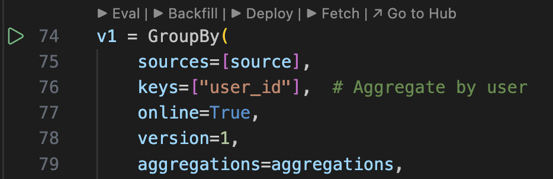

# Quickstart

Welcome to Zipline. This guide gets you set up with the two main developer tools — the **AI agent** and the **VS Code extension** — and walks you through the core workflow: authoring features, backfilling data, deploying pipelines, and serving features online.

---

## Step 1: Install the AI Agent

The Zipline AI agent is a context file that gives your coding assistant deep knowledge of the Chronon API and Zipline CLI. It knows how to author `GroupBy`s, `Join`s, `StagingQuery`s, and `Model`s, how to debug data issues, and how to use every `zipline` command.

First, install the `zipline-ai` CLI if you haven't already:

```bash
pip install zipline-ai
```

Then install the agent context for your preferred coding assistant:

```bash
zipline init-agent
```

This will prompt you to select your agent:

```
Which AI agent would you like to set up? (claude, codex, cursor, gemini, windsurf, copilot):
```

The context file is installed in the standard global location for that tool — for example, `~/.claude/skills/zipline/skill.md` for Claude Code or `~/.cursor/skills/zipline/SKILL.md` for Cursor. The command prints the exact path on success.

To install for a specific agent without the prompt:

```bash
zipline init-agent --agent claude    # Claude Code
zipline init-agent --agent codex     # Codex
zipline init-agent --agent cursor    # Cursor
zipline init-agent --agent gemini    # Gemini CLI
zipline init-agent --agent windsurf  # Windsurf
zipline init-agent --agent copilot   # GitHub Copilot
```

---

## Step 2: Install the Zipline VS Code Extension

The Zipline extension for VS Code and Cursor adds action buttons directly to your config files, letting you run `eval`, `backfill`, `deploy`, and `fetch` without leaving your editor.

Install it from the **VS Code Marketplace** or the **Cursor extension store** by searching for **"Zipline"**.

> **Don't use VS Code or Cursor?** All of the same operations are available via the [`zipline` CLI](/docs/reference/cli). The extension is a convenience layer — everything it does maps directly to a CLI command, and each section below links to the relevant command reference. The CLI experience requires more manual steps but works in any environment.

---

## Using the AI Agent

Once the agent context is installed, you can ask your coding assistant to help with any part of the Zipline workflow. Here are some examples of what you can do.

### Get oriented

> *"Describe Zipline to me at a high level. What are GroupBys and Joins, how do they relate to each other, and how do I use them to author, backfill, and serve features?"*

The agent will explain the core concepts — how `GroupBy`s define feature aggregations over a source table, how `Join`s combine multiple `GroupBy`s into a wide training dataset with point-in-time correctness, and how the same definitions power both offline backfills and online serving. A good starting point before diving into authoring.

---

### Author a new pipeline

> *"Author a GroupBy that computes 1, 7, and 30 day rolling sums and counts of purchase amounts keyed by user_id, sourced from the purchases table in BigQuery."*

The agent will look up the table schema, check for existing GroupBys with the same source and keys (to avoid duplication), and write the full `GroupBy` definition with the correct `EventSource`, `Query`, `time_column`, and `Aggregation` list. It will then compile the config and run `zipline hub eval` to validate it before presenting the result.

---

### Discover available tables

> *"What tables are available in the `analytics` dataset in BigQuery?"*

The agent will run `zipline hub list-tables analytics --engine-type BIGQUERY` and return the full list. If you give a partial or misspelled table name elsewhere, the agent will use this command to find close matches and confirm the right table with you before proceeding.

---

### Modify an existing feature

> *"Add a 10-day window to all aggregations in the `user_purchases` GroupBy. Bump the version."*

The agent will read the existing GroupBy, add `"10d"` to every `windows` list, and rename the variable from `v1` to `v2` (or whichever the next version is). If you say "make the change in place" instead, it will edit the existing variable without versioning. The agent will recompile and re-eval after the change.

---

## Using the VS Code Extension

The Zipline extension adds a set of action buttons to the editor when you have a compiled config file open. Here is what each button does:



### Eval

Validates your configuration against your data warehouse. Checks that all source tables exist, column names and types match, query syntax is valid, and dependencies resolve correctly. This is fast — it does not run any Spark jobs. Use it constantly during development.

CLI equivalent: [`zipline hub eval`](/docs/reference/cli#zipline-hub-eval)

### Backfill

Runs a historical backfill for the selected config over a date range you specify. For a `Join`, this produces the wide training dataset with point-in-time correct feature values. For a `GroupBy`, it populates the offline snapshot table.

CLI equivalent: [`zipline hub backfill`](/docs/reference/cli#zipline-hub-backfill)

### Deploy

There are two deploy modes:

**Adhoc deploy** runs a one-off job from your current branch. Use this to test a feature end-to-end — including online serving — before merging. The job runs against your branch's configs, so your main branch is unaffected.

**Scheduled deploy (merge-triggered)** is the production path. When you merge a PR, Zipline automatically ingests all new and changed configs and schedules their associated recurring jobs. You do not need to manually trigger anything after merging — scheduling is handled for you.

You can also manually schedule a deploy from a branch without merging. This is useful for running a dev version of a pipeline in parallel with production — for example, to do end-to-end A/B testing of a new feature version before promoting it to main. When doing this, make sure the version in your branch config is different from the one on main so the two pipelines run independently and don't overwrite each other's data.

For experiments from a branch, the recommended flow is:
1. Author your features on a branch and run `Eval` to validate them.
2. Use **Adhoc deploy** to run the pipeline and test online serving from your branch.
3. When you're satisfied, open a PR. After it merges, Zipline automatically schedules production runs.

CLI equivalents: [`zipline hub run-adhoc`](/docs/reference/cli#zipline-hub-run-adhoc) (adhoc) · [`zipline hub schedule`](/docs/reference/cli#zipline-hub-schedule) (manual schedule deploy)

### Fetch

Fetches feature values for a given primary key from the online KV store. Use this after an adhoc or scheduled deploy to verify that online serving is returning the values you expect.

CLI equivalent: [`zipline hub fetch`](/docs/reference/cli#zipline-hub-fetch)

### Go to Hub

Opens the Zipline Hub UI for the selected config. From the Hub you can monitor job status, inspect output schemas, view lineage, and track data quality metrics.

---

## Next Steps

- [Authoring GroupBys](/docs/authoring_features/GroupBy) — full reference for the GroupBy API
- [Authoring Joins](/docs/authoring_features/Join) — combining GroupBys into training datasets
- [Eval](/docs/running_on_zipline_hub/Eval) — detailed guide to configuration validation
- [Deploy](/docs/running_on_zipline_hub/Deploy) — understanding scheduled vs. adhoc deployment
- [CLI Reference](/docs/reference/cli) — full reference for all `zipline` commands
- [Local Sandbox](/docs/getting_started/Local_Sandbox) — explore Chronon locally without a Zipline subscription
