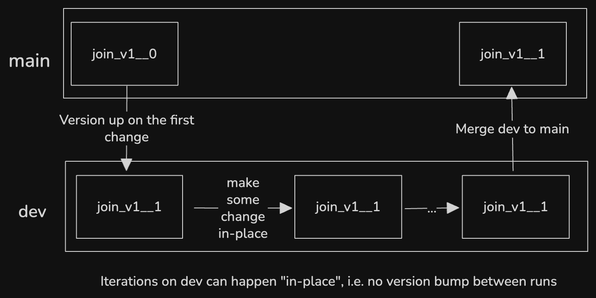

# Iteration on Zipline

Zipline uses the concept of versions to make it safe and easy to iterate on existing entities.

We suggest taking a look at the [Naming and Versioning](../authoring_features/NamingAndVersioning.md) documentation if you haven't already.

This doc will explain the process

## Overview

The basic steps to make a change to an existing entity in Chronon are:

### Step 0: Make a git branch

Zipline enforces that all changes must occur on a branch to guarantee that production data isn't accidentally altered.

### Step 1: Make your changes and bump versions

(See [Naming and Versioning](../authoring_features/NamingAndVersioning.md) for an explanation of how to change a version).

You can change multiple entities at once here.

For example, say you have a `GroupBy X` that is used in `Join A` and `Join B`, and you wish to add some features to it. You would likely bump the version of all three entities here, unless you were only adding the new features to one of the joins and excluding from the other, then you could only bump the single Join version.

### Step 2: Test the new version

You can now run the new version using the standard testing flows. See [Testing](./Test.md) for more details.

### Step 3: Make further changes

Often a user may wish to continue to iterate on a dev version. **This can happen in-place without further version bumps**. The `compile` may warn you that a change is taking place in-place, however, it's not a cause for concern as long as you're still on your dev version.

Note that if you're using `zipline hub backfill` to re-run a range that has already been computed, you'll need to be sure to include the `--force-recompute` flag for the change to trigger.

For example: `zipline hub backfill --conf compiled/joins/{team}/{conf} --start-ds {start} --end-ds {end} --force-recompute`

Note: if you make a schema changing diff and run `backfill` for a certain range, the existing table for your version will be recreated and only the backfilled range will exist after the job completes. For example, if you had 1 year in your table, then made a change and ran for 1 day, you'd only see 1 day after the job completes. This does not, however, mean that existing computation for the longer range is lost. Chronon stores compute in internal cache tables and continues to reuse it where possible. In this case, this means that if you ran the `backfill` command for the full year, it would still reuse any unchanged computation from the initial table.

### Step 4: Merge

Once you're satisfied with your change, you can merge it to main for it to be orchestrated in production.
