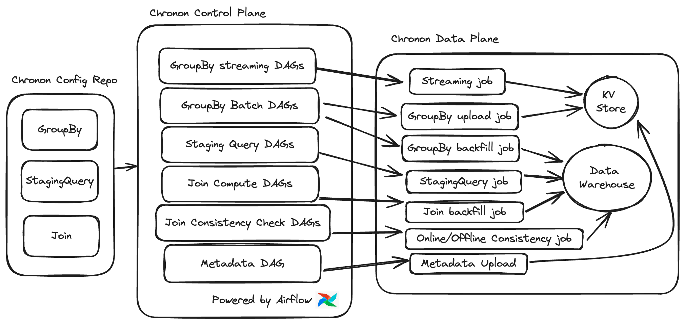

# Control Plane Overview

All the jobs that Chronon runs are driven by the configs in the Chronon repo. The orchestrator (Airflow by default) is configured to read the files in the repo and kick off a number of jobs to drive data and metadata flows. This is illustrated below:

At a high level, the flow is `config (GroupBy/Join/StagingQuery) -> control plane action -> data plane action/result`. The production DAGs run these actions based on certain triggers for each config type (i.e. upstream data landing), however, these control plane actions can also be triggered manually using the `run.py` CLI utility.

The table below gives further details on each of these control plane tasks, and their corresponding Data plane actions:

|                   | Dag name format                               | Relationship to repo | Trigger               | Data plane purpose                                                             |
| ----------------- | --------------------------------------------- | -------------------- | --------------------- | ------------------------------------------------------------------------------ |
| GroupBy Batch     | `chronon*group_by_batch*{team}`               | One DAG per team     | Upstream data landing | Run batch uploads to the KV Store. Produce historic snapshots of GroupBy Data. |
| GroupBy Streaming | `chronon*group_by_streaming*{team}`           | One DAG per team     | Continuous            | Run streaming jobs for realtime updates to KV Store.                           |
| StagingQuery      | `chronon*staging_query_batch*{team}`          | One DAG per team     | Upstream data landing | Run StagingQuery batch computation.                                            |
| Join Computation  | `chronon*join*{team}\_\_{join_id}`            | One DAG per Join     | Upstream data landing | Run Join backfill/frontfill.                                                   |
| Join Consistency  | `chronon*online_offline_comparison*{join_id}` | One DAG per Join     | Upstream data landing | Run job that checks consistency between online and offline values.             |
| Metadata          | `chronon_metadata_upload`                     | One DAG              | Daily                 | Upload necessary metadata to the KV store to enable serving.                   |

Here are a few code pointers that can be followed to get an even deeper understanding of each of these actions and their effect:

1. [run.py](https://github.com/zipline-ai/chronon/blob/main/api/python/ai/chronon/repo/run.py) - this is a CLI utility that can be used to trigger control plane flows directly, however, it is also called by production DAGs for executing scheduled actions.
2. [Driver.scala](https://github.com/zipline-ai/chronon/blob/main/spark/src/main/scala/ai/chronon/spark/Driver.scala) - this is the driver on the Scala side which drives the corresponding data plane actions. Run.py calls Driver.scala to run Spark jobs.