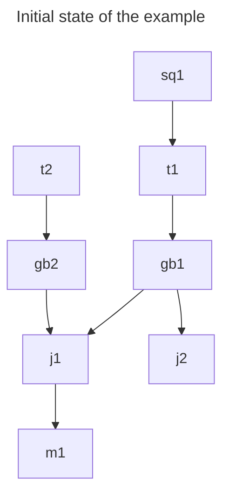
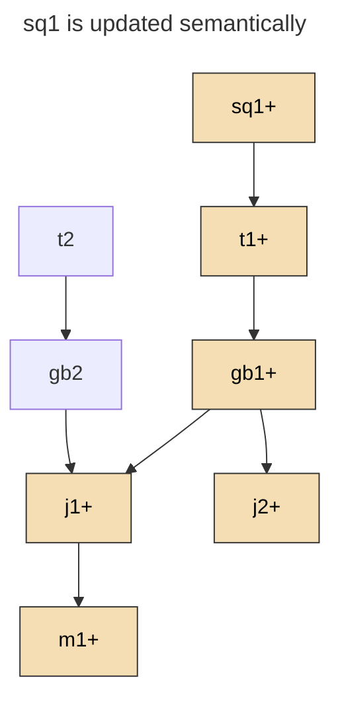
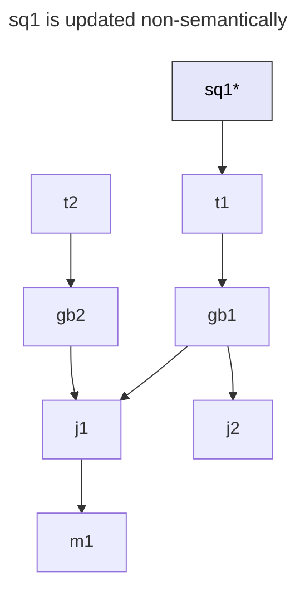
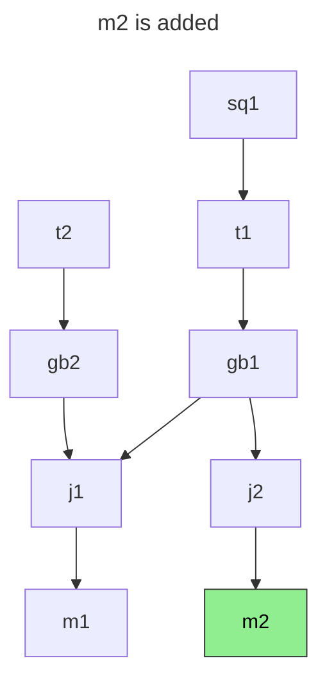
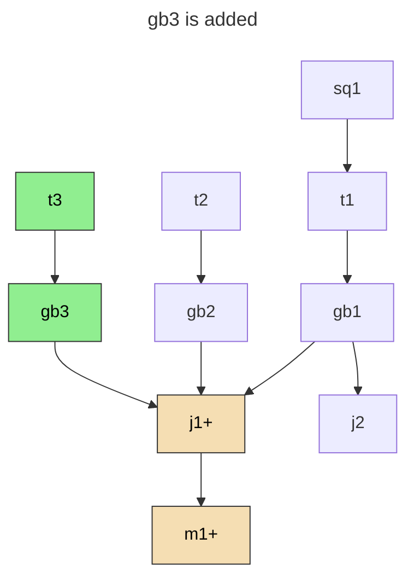
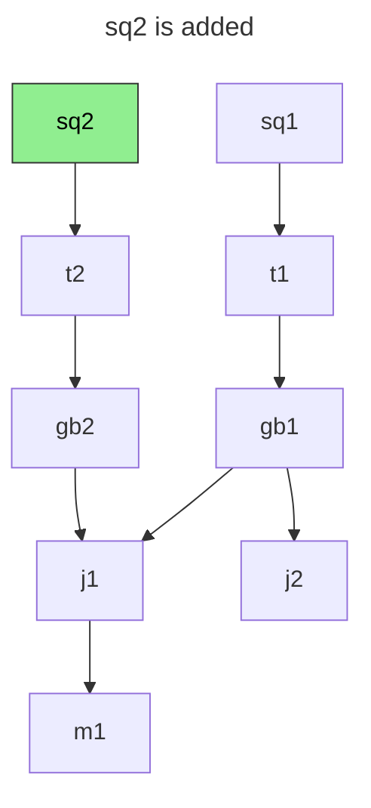
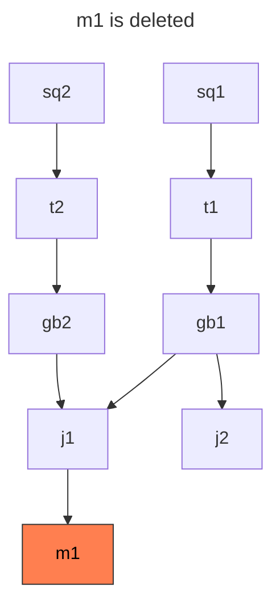
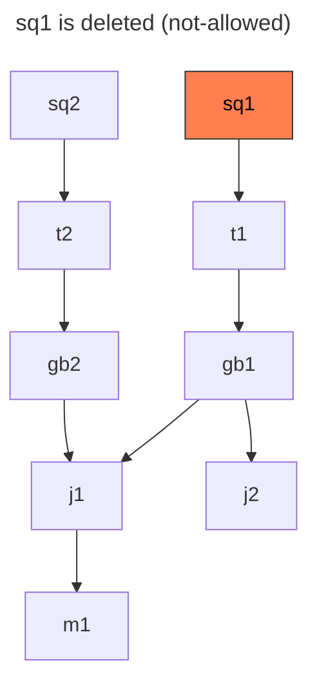
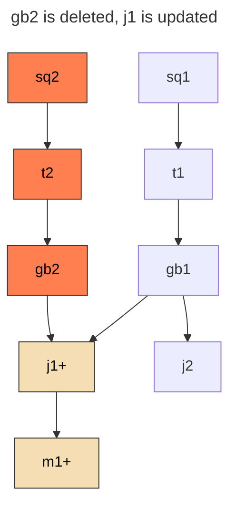

# Branch support

We want to support "branches" that allow users to run pipelines and services with two 
critical goals:

- don't pollute production datasets and end-points
- are cheap, by re-using as much of existing datasets as possible

## Scenarios within experimentation

While developing on a branch - users could
- make semantic updates - that change output data - eg., logic within where-s, selects, aggregations etc
- make non-semantic updates - that don't change output data - eg., spark exec memory, # of pods / workers etc
  - *note that everything that is stored in metadata field within our API's are non-semantic fields*
- add new nodes
- delete existing nodes
- make changes to several compute nodes at once
- decide to merge the branch into master

With this context, the goal of this document is to develop / describe a representation to handle the above user workflows.


## Motivating Example

Legend: 
```
"sq" stands for StagingQuery    "j" for Join
"t" stands for table            "m" for Model
"gb"  for GroupBy               
```

Nodes will be numbered - `gb4`, `m2` etc

Semantic changes to node notated using a plus "+".
Eg., Join `J3` becomes `J3+`

Non-Semantic changes with an asterisk "*" - `J3*` 




### Semantic updates

Say that, `sq1` changes semantically to `sq1+`. It is going to change the output of all  
nodes downstream of it.



> A major concern here is that, if the local repository of the user is behind remote, 
> we will a lot more changes than the user intends to.

One approach to mitigate this is to, only make the CLI only pick up changes to files listed as edited by 
commits to the git branch. 

Another approach is to force user to rebase on any change to the repo. However, this does not 
guarantee that changes while the job is running is accounted for.

### Non Semantic updates
Instead, if `sq1` changes non-semantically to `sq1-`. None of the downstream nodes would change.



Depending on who is running the job we need to decide which version of the node to use
- if the branch author is causing the node to be computed we need to use `sq1*` instead of `sq1`
- if the prod flow or other authors who haven't updated `sq1` are causing the compute, we should use `sq1`
- if another branch is also updating `sq1` non semantically to `sq1**` we need to use that instead. 

### Adding new nodes

Adding new leaf nodes will not impact any of the existing nodes. 




But adding non-leaf node - 
as parent to existing node - would almost always cause semantic updates to nodes downstream.



One interesting case here is migrating the sql from an external system to StagingQuery of an 
already used table. Even though this is not a leaf node, absorbing it as same as a leaf node change 
would be the right thing to do.




### Deleting existing nodes

Deleting leaf nodes is straight forward. We just need to program a cleanup mechanism 
to remove data and pipelines generated by that node.



Indirectly connected components - via table references - shouldn't be allowed to be deleted 
as long as there are nodes that depend on the table. We will fail this during the sync step.



Directly connected parents when deleted will have updates in the child node - or the compilation 
would fail. In these cases it would be ideal to garbage collect upstream chain of the deleted node.



### Isolating the changed assets

While development on a branch is in progress we need to create temporary data assets for
the semantically changed nodes - shown in yellow above. Adds, Deletes & Semantic Updates could 
trigger this flow.


#### Logic to achieve isolation
Make a new copy of the conf & update the name (file name & metadata.name) - 

`new_name = old_name + '_' + branch_name`

This needs to be followed by changing references in the downstream nodes - 
all tables and nodes downstream will have the branch suffix.

```
# 1. cli sends file_hash_map to remote

local_file_map = repo.compiled.file_hash_map
remote_file_map = remote.file_map
deleted = remote_file_map - local_file_map
added = local_file_map - remote_file_map
updated = [k in intersect(local_file_map, remote_file_map)] 
# 2. remote marks the changed files it needs

(node, lineage_hash) => 
```

### Merging changes into `main` 

- Deletes should actually trigger asset and pipeline clean up.
- Updates should trigger asset renaming
- Adds can work as is - we are not suffixing adds.
