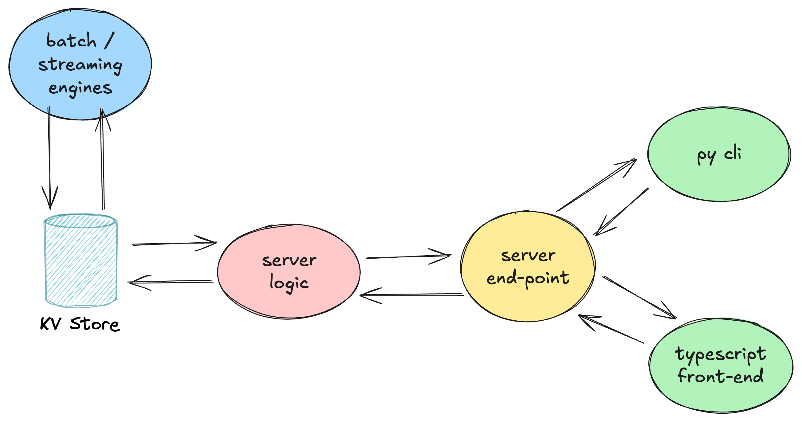

# Why?

We have a lot of glue code that maps data into objects across system and language boundaries. 
This glue code adds effort, reduces maintainability with added indirection and lacks type-safety.



We aim to reduce this glue code instead by using serialization protocols that generate code
into various languages. We choose Thrift because it is the most entrenched protocol for the Chronon codebase already.

This module adds ability to make REST api's type-safe and boilerplate free by mapping requests into thrift objects
automagically (via reflection). Developers still have full control over url design - as they did with vert.x before.


## Usage

We basically translate a `Func<Input, Output>` -> `Func<RequestContext, Response>`  via reflection to achieve this

### Setting up the endpoint

Thrift def
```c
struct TileKey {
  1: optional string column
  2: optional string slice
  3: optional string name
  4: optional i64 sizeMillis
}
```


Route declaration
```java
Function<TileKey, TileKey> thriftTransformer = input -> input;  // some dummy function

router.get("/thrift_api/column/:column/slice/:slice")
      .handler(RouteHandlerWrapper.createHandler(thriftTransformer, TileKey.class));
```               

### For json encoded results

Requesting
```java
client.get("/thrift_api/column/my_col/slice/my_slice")
      .addQueryParam("name", "my_name")
      .addQueryParam("sizeMillis", "5")
      .send()
```

Response
```json
{"column":"my_col","slice":"my_slice","name":"my_name","sizeMillis":5}
```

### For Thrift binary + base64 encoded results

Using thrift over the wire would shrink the payload significantly without additional deserialization penalty.
The reader side is expected to deserialize the thrift - simply by doing a base64 decode and using the `read` method
on the generated thrift classes.


Simply request with additional header param `response-content-type` set to `application/tbinary-b64`.

Below is a java way of calling - but you replicate this in any other language or cli.

```java
client.get("/thrift_api/column/my_col/slice/my_slice")
      .addQueryParam("name", "my_name")
      .addQueryParam("sizeMillis", "5")
      .putHeader("response-content-type", "application/tbinary-b64")
      .send()
```

This will produce data that looks like below. 
The `data` key holds base64 encoded string of thrift binary protocol bytes.

```json
{"data":"CAABAAAAZAgAAgAAAAAA","contentType":"application/tbinary-b64"}
```

Not every language has TBinaryProtocol support. But if our py cli wants to use it to
request large graphs for lineage & planning, this should shrink the payload by a good percentage.

